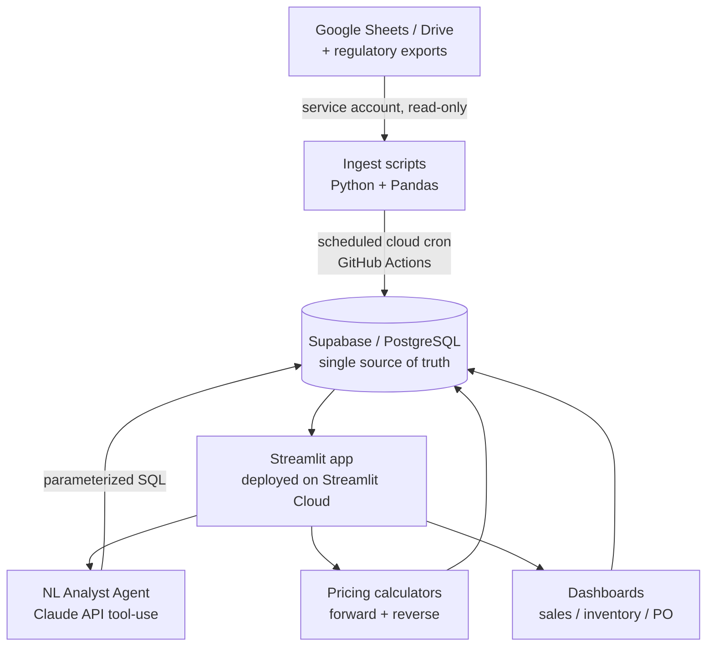

# AI-Native Intelligence Platform for a Wine & Spirits Agency

*A production data + AI system I designed, built, and deployed as **Intelligence Coordinator** at Bonvin Wine & Spirits Merchants. It turns raw market, pricing, and inventory data into decision-useful intelligence for the CEO and sales team.*

> **Scope & confidentiality:** This write-up is sanitized. It contains **no proprietary prices, landed costs, margins, customer/licensee records, or credentials.** Regulatory pricing rules referenced (BC LDB / AGLC markup, excise, container-recycling fees) are **public**. The goal here is to show the engineering, not the business data.

---

## Overview

A one-person build spanning data engineering, applied LLMs, and product delivery. Raw data lives in Google Sheets/Drive and regulatory exports; a scheduled pipeline lands it in a Postgres database; a deployed web app then serves a **natural-language analytics agent**, **pricing-intelligence calculators**, and **live dashboards** on top of it.

**Stack:** Python (Pandas) · Claude API (LLM tool-use / function calling) · Supabase / PostgreSQL · Streamlit (deployed on Streamlit Cloud) · GitHub Actions (cron) · SQL · bilingual EN / 中文.

**System at a glance**
- **315 products** across **2 sales channels** and **7 countries**, unified in one governed catalog.
- **Daily** automated refresh (cloud cron), replacing a laptop-dependent manual process.
- Forward **and reverse** pricing **validated to the cent** across the full catalog.
- Grounded LLM agent — **every figure cites its source row**; zero invented numbers by design.

---

## Architecture

The app **only ever reads the database**, never the source sheets directly — so every surface shows the same governed, single-source-of-truth data.

---

## What I built

### 1 · Natural-language analytics agent (grounded LLM tool-use)
A "Product Analyst" that answers plain-language questions ("which French reds have more than 5 cases in stock?") by querying the live database — engineered so **it cannot hallucinate numbers**:

- Uses the **Claude API with tool-use (function calling)**: the model chooses a typed tool and fills structured filters; **it never writes raw SQL**. The backend runs **parameterized queries**, and the answer is constrained to the returned rows, which are shown alongside every figure.
- Hardened against real failure modes I hit in production: tool-input schema validation and sanitization, a **least-privilege read-only** database credential, row caps, and cost controls (small/fast model tier, token and result limits).

### 2 · Pricing-intelligence engines (forward + reverse)
- Implemented the official **graduated-markup + excise + container-recycling-fee** wholesale formula and **validated it to the cent** against the regulator's own calculator across the entire catalog.
- Built the **reverse solver** — *target wholesale price → implied markup / margin* — as a **strict inverse** of the forward function, correctly reporting "unreachable" when a target falls in a rounding gap.
- Modeled a subtle real-world rule others missed: **ceramic containers** (all Chinese baijiu) carry a very different recycling fee, which had been silently under-pricing a whole product line.

### 3 · Automated data pipeline (single source of truth)
- `Sheets / Drive → service account → idempotent ingest → Postgres`; the app reads Postgres only.
- Migrated scheduling from a laptop to **cloud cron (GitHub Actions)** for reliability, added **per-table freshness timestamps + failure alerting**, honest *"data as-of"* badges in the UI, and consolidated every feed to a **single writer** to eliminate drift.

### 4 · Entity resolution & data enrichment
- Joined regulatory registration and licensing datasets by license number using **exact + normalized/fuzzy matching**, backed by an **auditable, human-in-the-loop crosswalk** that **never auto-links on uncertainty** — flagging ambiguous matches for review instead of guessing.
- Enriched inventory with full canonical product names and country/type attributes derived from source workbooks.

### 5 · Engineering practice
- Practiced **spec-driven development (SDD)**: wrote normative requirements and **failure scenarios before writing code**, so edge cases (data-source outages, unreachable prices, duplicate runs, ambiguous matches) were handled by design.
- **Automated tests**: pricing round-trip (reverse→forward to the cent), grounding, and ingest-regression tests. Secrets kept out of source control; data files gitignored.

---

## Evaluation & impact (sanitized)

**How I know it's correct**
- **Pricing:** automated round-trip tests — reverse-solve a target price, feed it back through the forward engine, assert equality **to the cent**; matched the official regulatory calculator across the full 315-SKU catalog.
- **Agent grounding:** answers are constrained to the returned rows and display them, so every figure is independently verifiable; tool inputs are schema-validated and sanitized.
- **Ingest:** regression tests plus fail-loud guards (absent source → skip cleanly; malformed → hard error) so bad data never loads silently.

**Impact**
- Turned **one-by-one manual pricing into a single catalog-wide run** — the entire catalog is repriced in one pass and stays penny-accurate to regulation.
- Gave the CEO and sales team **self-serve, plain-language access** to live pricing, stock, and registration data instead of waiting on a manual report.
- **Single source of truth:** every screen reads one governed database, with visible data-freshness so no one acts on stale numbers.

---

## Screenshots

*(Add 1–2 sanitized screenshots — e.g. the Product Analyst answering a question with its source-row panel, and a sales dashboard — plus a small schema snapshot of the core tables. Blur or omit any real prices, costs, or customer/licensee names.)*

---

## Why this is relevant to applied AI

- **Applied LLM engineering** — practical tool-use / function-calling, grounding & anti-hallucination design, safety (least privilege), and cost control.
- **End-to-end data systems** — pipelines, a relational database, cloud deployment, and monitoring.
- **Rigor** — validation to the cent, automated testing, reproducibility, and up-front specification of failure modes.

*Built and maintained solo. Architecture and code authored by me; this document describes the system at a level that respects the employer's confidentiality.*
